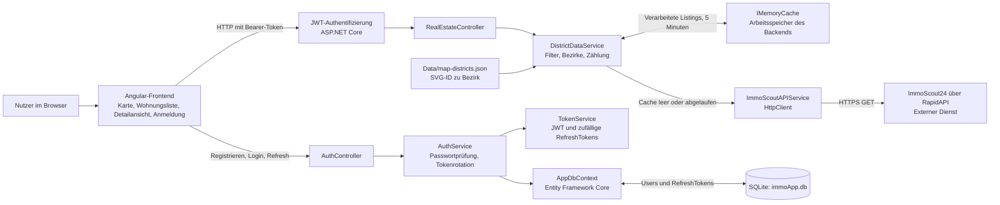
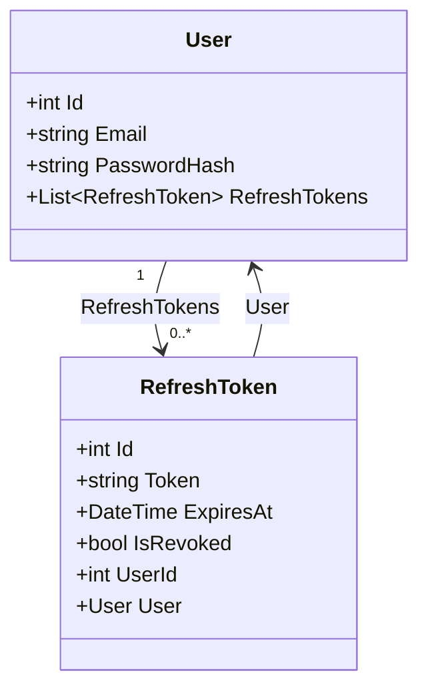
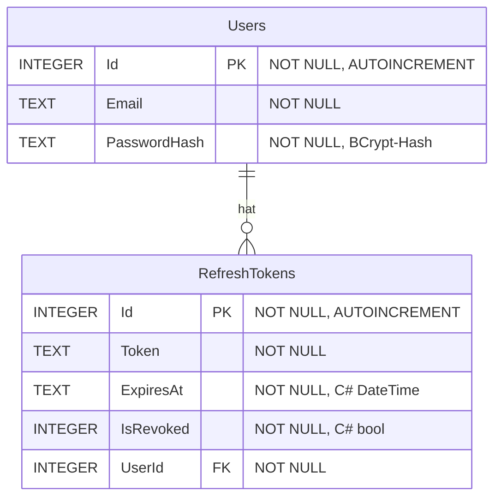

# Systemarchitektur von TopImmo

Stand: 04.10.2026. Dieses Dokument beschreibt den aktuellen lokalen Quellcode. TopImmo unterstützt die Suche nach Mietwohnungen in Stuttgart und die Auswahl eines Bezirks über eine Karte.

## Komponenten und Datenfluss

Das Angular-Frontend ruft das eigene Backend auf. Die externe Immobiliensuche führt der C#-Service mit `HttpClient` aus. Das Backend verarbeitet die Antwort und liefert JSON an das Frontend. Der `RealEstateController` ist mit `[Authorize]` geschützt; Registrierung, Login und Refresh sind separate Auth-Endpunkte.

Die Immobiliendaten liegen für fünf Minuten im RAM-Cache. SQLite speichert Benutzer mit Passwort-Hash sowie RefreshTokens. Eine Speicherung der Immobilien in SQLite ist im aktuellen Code nicht implementiert. Die lokale JSON-Datei ordnet SVG-Elemente der Karte Bezirken zu; sie enthält keine laufend geladenen Wohnungsangebote.

Belege: [Programmstart und registrierte Dienste](../Backend/ImmscoutAPI/Program.cs#L14), [Immobiliencontroller](../Backend/ImmscoutAPI/Controllers/RealEstateController.cs#L8), [AuthController](../Backend/ImmscoutAPI/Controllers/AuthController.cs#L18), [Datenverarbeitung und Cache](../Backend/ImmscoutAPI/Service/DistrictDataService.cs#L22), [Frontend-Immobiliendienst](../Frontend/TomInnoFrondEnd/src/app/services/realestate.ts#L10), [Bearer-Interceptor](../Frontend/TomInnoFrondEnd/src/app/interceptors/auth.interceptor.ts#L20).

## Öffentliche Endpunkte des eigenen Backends

| Methode und Pfad | Aufgabe | Anmeldung erforderlich |
|---|---|---|
| `POST /api/auth/register` | Benutzer anlegen; Passwort als BCrypt-Hash speichern | Nein |
| `POST /api/auth/login` | Passwort prüfen; JWT und RefreshToken ausgeben | Nein |
| `POST /api/auth/refresh` | RefreshToken prüfen und rotieren | Nein; ein gültiger RefreshToken ist nötig |
| `GET /api/realestate/stuttgart-listings?district=Mitte` | Mietangebote, Bezirkszählungen und Kartenzuordnung liefern | Ja |
| `GET /api/realestate/listings/{id}` | Einzelnes Angebot aus den verarbeiteten Daten suchen | Ja |

Die Bezirkszählung berücksichtigt alle geladenen Mietangebote, auch wenn die zurückgegebene Liste auf einen Bezirk gefiltert wird. Ein fehlendes Detailangebot ergibt HTTP 404, eine leere Suche HTTP 200 mit leerer Liste.

## UML-Klassenansicht der gespeicherten Daten

Die Klassen besitzen die folgenden C#-Typen und Navigationsbeziehungen:

Belege: [User](../Backend/ImmscoutAPI/Model/Authorization/User.cs#L3), [RefreshToken](../Backend/ImmscoutAPI/Model/Authorization/RefreshToken.cs#L3), [DbContext](../Backend/ImmscoutAPI/DataBase/AppDbContext.cs#L6).

## SQLite-Datenmodell

Die Migration bildet die C#-Typen auf die folgenden SQLite-Typen ab:

Jeder RefreshToken gehört zu genau einem Benutzer. Ein Benutzer kann keinen, einen oder mehrere RefreshTokens haben. `RefreshTokens.UserId` verweist auf `Users.Id`; die Migration legt einen Index auf `UserId` und `ON DELETE CASCADE` an. Alle dargestellten Spalten sind `NOT NULL`. Die E-Mail besitzt keinen `UNIQUE`-Constraint: Der Service prüft vor dem Anlegen auf eine bereits vorhandene E-Mail. Das ist eine Prüfung im Programm, keine Eindeutigkeitsgarantie der Datenbank.

Das Backend wendet beim Start EF-Core-Migrationen an. Zusätzlich zu den beiden Anwendungstabellen können technische SQLite-/EF-Tabellen existieren; sie sind hier nicht als fachliche Entitäten dargestellt.

Belege: [Tabellen und Constraints der Migration](../Backend/ImmscoutAPI/Migrations/20260701123011_InitialCreate.cs#L14), [E-Mail-Prüfung](../Backend/ImmscoutAPI/Service/AuthService%20.cs#L21), [Migration beim Start](../Backend/ImmscoutAPI/Program.cs#L55).

## Grenzen des aktuellen Systems

- Die externe Anfrage verwendet fest `page=1` und `pageSize=30`. Die Zählungen beschreiben die geladenen Treffer und keine vollständige Statistik aller Mietangebote in Stuttgart. Weitere API-Seiten werden nicht geladen.
- Der Cache besteht pro laufendem Backend-Prozess und geht bei dessen Beendigung verloren. Es gibt keine dauerhafte Offline-Kopie der Angebote.
- HTTP-Fehler des externen Dienstes und ungültiges JSON können als Ausnahmen bis zum Controller gelangen. Eine eigene verständliche HTTP-Fehlerantwort für diesen Fall fehlt.
- Registrierung hat derzeit keine wirksame serverseitige Prüfung von E-Mail-Format oder Mindestlänge des Passworts. RefreshTokens werden als Tokenwerte in SQLite gespeichert.

Belege: [API-Service, feste Anfrageparameter](../Backend/ImmscoutAPI/Service/ImmoScoutAPIService.cs#L17), [Cache und Deserialisierung](../Backend/ImmscoutAPI/Service/DistrictDataService.cs#L22), [RegisterRequest](../Backend/ImmscoutAPI/DTO/RegisterRequest.cs#L3), [AuthService](../Backend/ImmscoutAPI/Service/AuthService%20.cs#L21).

## Verifikation und Reichweite

Am 04.10.2026 war der vollständig neu kompilierte Backend-Build erfolgreich, mit 0 Fehlern und 28 Warnungen zu nicht initialisierten nicht-nullbaren Modelleigenschaften. Die vorhandenen [Backend-Checks](../Backend/ImmscoutAPI.Checks/Program.cs#L17) bestanden. Sie prüfen die Listing-Verarbeitung sowie echte lokale HTTP-Anfragen an die Immobilienendpunkte mit simulierten API-Antworten und einem Testauth-Handler.

Zusätzlich wurde der echte Backend-Auth-Flow mit einer eigenen temporären SQLite-Datenbank geprüft: Registrierung, Duplikatprüfung, Passwortprüfung, Ausgabe von Tokens und Refresh-Rotation funktionierten. Ein bereits rotierter RefreshToken wurde abgewiesen. Dabei wurde auch nachgewiesen, dass leere oder ungültige Registrierungsdaten akzeptiert werden. Dieser zusätzliche Prüflauf ist bisher kein automatisierter Test im Repository.

Die externe RapidAPI wurde bei diesen Prüfungen nicht aufgerufen. Ein vollständiger Live-Durchlauf vom Login bis zur Anzeige aktueller externer Immobilienangebote ist damit nicht nachgewiesen. Der gültige JWT wurde in diesem zusätzlichen Prüflauf nicht gegen einen Live-Immobilienabruf getestet.

Weiterlesen: [Pseudocode der wichtigsten Algorithmen](algorithmen.md).
