# Systemarchitektur von TopImmo

Stand: 05.10.2026. Dieses Dokument beschreibt den aktuellen lokalen Quellcode. TopImmo unterstützt die Suche nach Mietwohnungen in Stuttgart und die Auswahl eines Bezirks über eine Karte.

## Projektstruktur als UML-Klassendiagramme

Die vier Ansichten zeigen die zentralen Klassen, Interfaces, Mitglieder und Beziehungen des aktuellen Codes. Die SVG-Bilder sind ohne zusätzliche Markdown-Erweiterung sichtbar; der Mermaid-Quelltext steht jeweils darunter. Die bearbeitbare [PlantUML-Datei](architektur.puml) enthält dieselben vier Ansichten.

**Legende:** `+` öffentlich, `-` privat; gestrichelter Pfeil = Abhängigkeit, gestrichelter Pfeil mit Dreieck = Interface-Implementierung, durchgezogener Pfeil mit Dreieck = Vererbung, ausgefüllte Raute = Template-Komposition. `1` und `0..*` kennzeichnen Kardinalitäten. Framework-Typen und Funktionsknoten sind ausdrücklich markiert. Gezeigt sind zentrale Mitglieder, keine vollständige Auflistung jeder Hilfsmethode.

Die Dateinamen `AuthService .cs` und `TokenService .cs` enthalten im Projekt ein Leerzeichen; die Klassennamen im Diagramm lauten trotzdem `AuthService` und `TokenService`.

### 1. Angular-Frontend

Komponenten verwenden drei gemeinsame Services. Die beiden Controller rechts stehen für die HTTP-Schnittstelle zum C#-Backend. Guard und Interceptor sind Funktionsknoten; Routen und `appConfig` sind Konfiguration, keine eigenen Klassen. `App` zeigt die Seiten über `RouterOutlet` an.

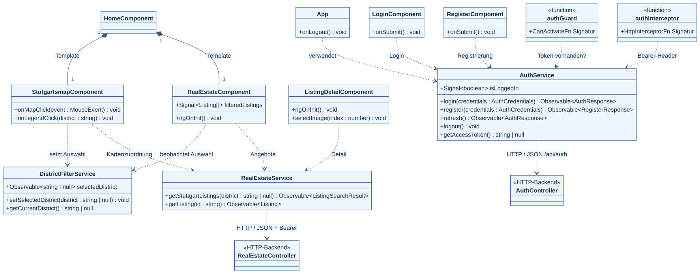

<details>
<summary>Mermaid-Quelltext anzeigen</summary>

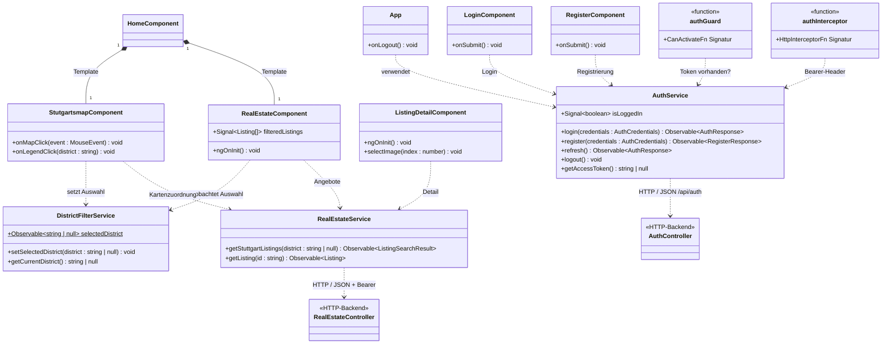

</details>

Belege: [Komponenten und Routen](../Frontend/TomInnoFrondEnd/src/app/app.routes.ts), [AuthService](../Frontend/TomInnoFrondEnd/src/app/services/auth.ts), [RealEstateService](../Frontend/TomInnoFrondEnd/src/app/services/realestate.ts), [DistrictFilterService](../Frontend/TomInnoFrondEnd/src/app/services/district-filter.ts), [Guard](../Frontend/TomInnoFrondEnd/src/app/guards/auth.guard.ts), [Interceptor](../Frontend/TomInnoFrondEnd/src/app/interceptors/auth.interceptor.ts).

### 2. Backend: Authentifizierung und SQLite

`AuthController` verwendet `IAuthService`. Die Implementierung prüft Passwörter und speichert über EF Core; `TokenService` erzeugt JWTs und Refresh-Tokens. Nur die zwei dargestellten Entitäten werden in SQLite gespeichert.

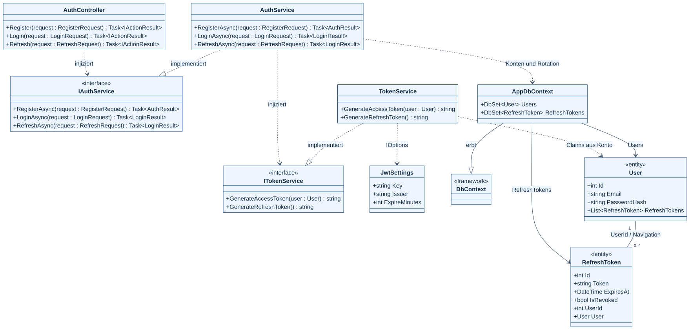

<details>
<summary>Mermaid-Quelltext anzeigen</summary>

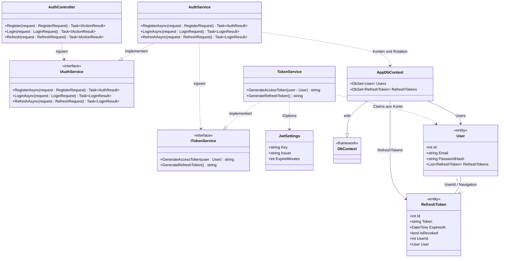

</details>

Belege: [AuthController](../Backend/ImmscoutAPI/Controllers/AuthController.cs), [AuthService](../Backend/ImmscoutAPI/Service/AuthService%20.cs), [TokenService](../Backend/ImmscoutAPI/Service/TokenService%20.cs), [AppDbContext](../Backend/ImmscoutAPI/DataBase/AppDbContext.cs), [User](../Backend/ImmscoutAPI/Model/Authorization/User.cs), [RefreshToken](../Backend/ImmscoutAPI/Model/Authorization/RefreshToken.cs).

### 3. Backend: Immobiliensuche, Cache und Synchronisierung

`DistrictDataService` bereitet das externe JSON auf, bildet Stadtteile auf Bezirke ab und liefert die API-Antwort. `IMemoryCache` hält die aufbereiteten Angebote fünf Minuten pro Prozess; die statische Semaphore serialisiert das Nachladen.

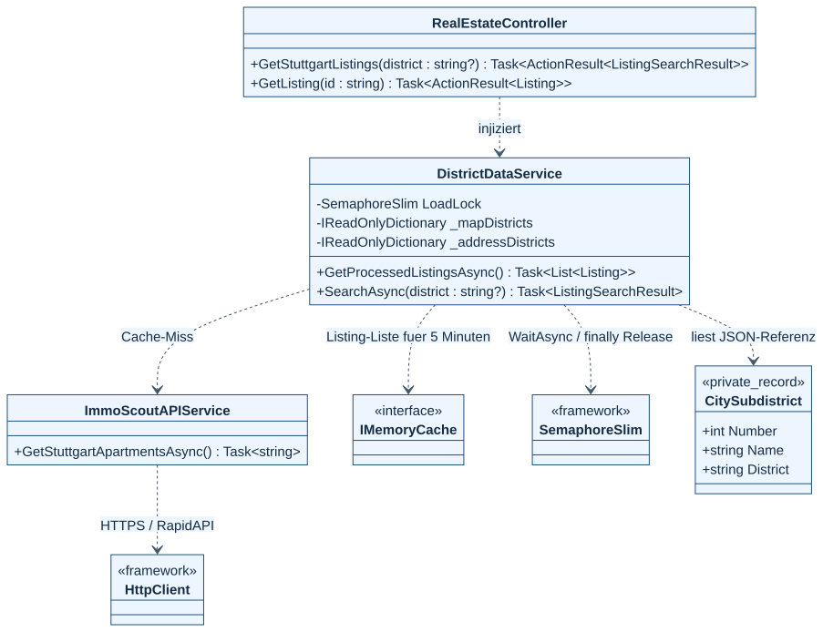

<details>
<summary>Mermaid-Quelltext anzeigen</summary>

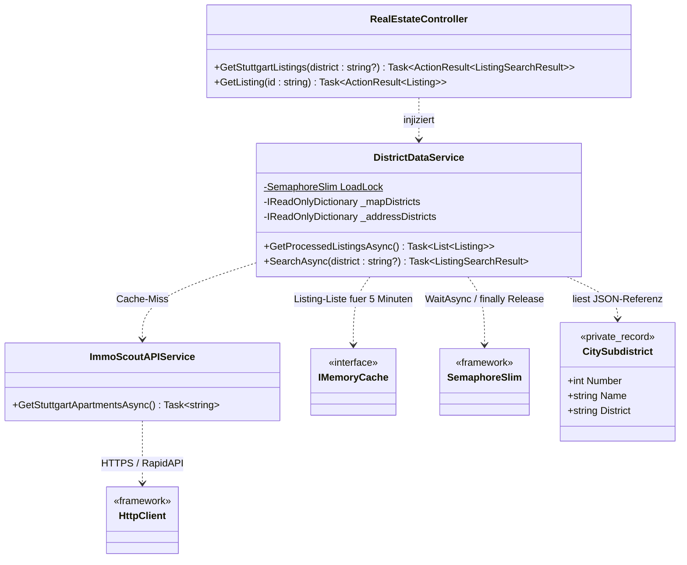

</details>

Belege: [RealEstateController](../Backend/ImmscoutAPI/Controllers/RealEstateController.cs), [DistrictDataService](../Backend/ImmscoutAPI/Service/DistrictDataService.cs), [ImmoScoutAPIService](../Backend/ImmscoutAPI/Service/ImmoScoutAPIService.cs), [Dienstregistrierung](../Backend/ImmscoutAPI/Program.cs).

### 4. Immobilien- und JSON-Datenmodelle

`ImmoScoutResponse` bildet die externe Antwort ab. Das Backend filtert daraus Mietangebote und erzeugt `ListingSearchResult` für Angular. Die weiteren Projekt-/Paginierungsfelder werden mit deserialisiert; die aktive Mietangebotssuche verwendet sie nicht.

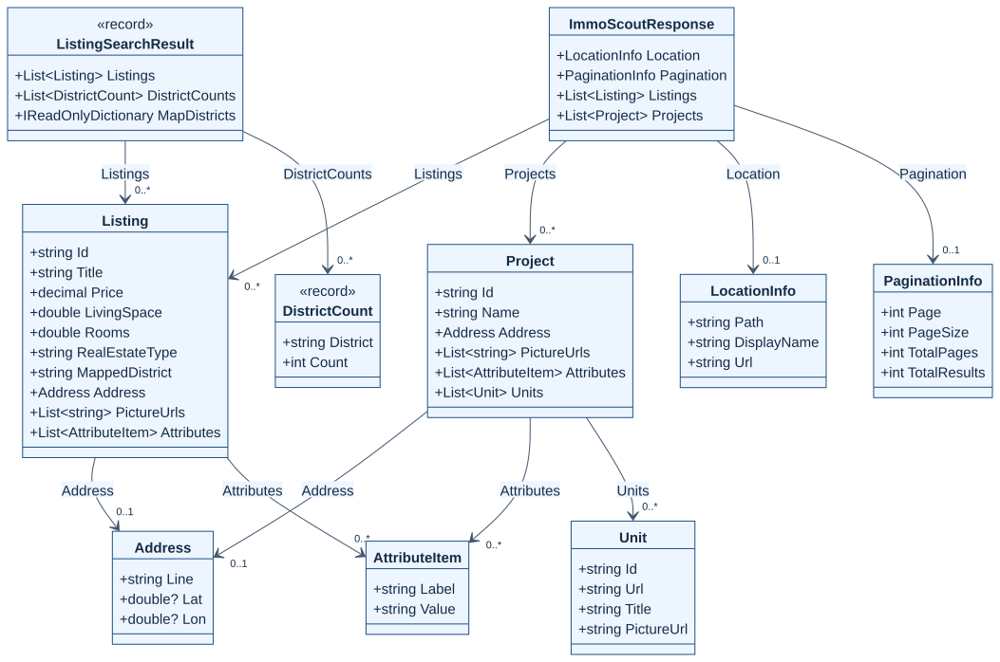

<details>
<summary>Mermaid-Quelltext anzeigen</summary>

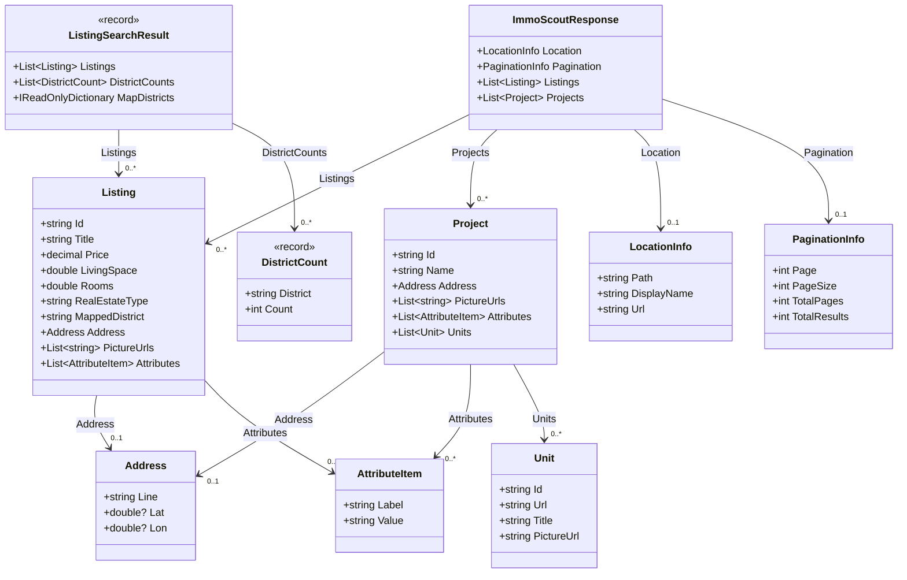

</details>

Belege: [Externe Antwort](../Backend/ImmscoutAPI/Model/ImmoScoutResponse.cs), [Listing](../Backend/ImmscoutAPI/Model/Listing.cs), [ListingSearchResult und DistrictCount](../Backend/ImmscoutAPI/Model/ListingSearchResult.cs), [Project](../Backend/ImmscoutAPI/Model/Project.cs).

`MapDistricts` und die beiden Bezirksreferenzen haben den C#-Typ `IReadOnlyDictionary<string, string>`; im Mermaid-Bild ist dessen Schreibweise aus Darstellungsgründen gekürzt. In der PlantUML-Datei steht der vollständige Typ. Für externe Adresse/Location/Pagination bedeutet `0..1`, dass das JSON das Feld weglassen kann; eine nichtnullable C#-Deklaration erzwingt kein vorhandenes JSON-Feld.

DTOs für Authentifizierung: `RegisterRequest` und `LoginRequest` besitzen `Email` und `Password`; `RefreshRequest` besitzt `RefreshToken`. `AuthResult` und `LoginResult` sind voneinander unabhängige Ergebnisklassen. `WeatherForecast` und das Frontend-Interface `ImmoResponse` werden im aktuellen Produktablauf nicht verwendet und deshalb nicht als aktive Klassen eingezeichnet. EF-Migrationen, Testprogramme und Konfigurationskonstanten sind ebenfalls keine zusätzlichen fachlichen Dienste.

### UML-Datei öffnen oder exportieren

Öffne [architektur.puml](architektur.puml) beispielsweise mit einer PlantUML-Vorschau in VS Code. Die Datei enthält vier benannte `@startuml`-Blöcke. Ein lokaler PlantUML-Renderer kann daraus vier SVGs exportieren:

```sh
java -jar /pfad/zu/plantuml.jar -tsvg docs/architektur.puml
```

Die Datei verwendet Smetana als Layoutverfahren. Die hier eingebundenen SVG-Vorschauen sind bereits erstellt; zum Ansehen wird kein Java benötigt. Syntaxreferenzen: [Mermaid-Klassendiagramme](https://mermaid.js.org/syntax/classDiagram.html) und [PlantUML-Klassendiagramme](https://plantuml.com/class-diagram).

## Komponenten und Datenfluss

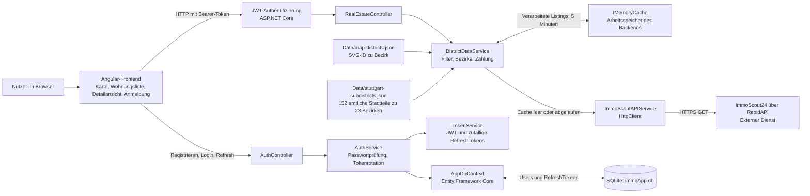

Das Angular-Frontend ruft das eigene Backend auf. Die externe Immobiliensuche führt der C#-Service mit `HttpClient` aus. Das Backend verarbeitet die Antwort und liefert JSON an das Frontend. Der `RealEstateController` ist mit `[Authorize]` geschützt; Registrierung, Login und Refresh sind separate Auth-Endpunkte.

Die Immobiliendaten liegen für fünf Minuten im RAM-Cache. SQLite speichert Benutzer mit Passwort-Hash sowie RefreshTokens. Eine Speicherung der Immobilien in SQLite ist im aktuellen Code nicht implementiert. Lokale JSON-Dateien ordnen SVG-Elemente und amtliche Stadtteilnamen den Bezirken zu; sie enthalten keine laufend geladenen Wohnungsangebote. Ein Stadtteilklick filtert dessen Elternbezirk. Die Legende zeigt alle 23 Bezirke, auch ohne Treffer, und gegebenenfalls die Gruppe „Ohne Bezirksangabe“.

Belege: [Programmstart und registrierte Dienste](../Backend/ImmscoutAPI/Program.cs#L14), [Immobiliencontroller](../Backend/ImmscoutAPI/Controllers/RealEstateController.cs#L8), [AuthController](../Backend/ImmscoutAPI/Controllers/AuthController.cs#L18), [Datenverarbeitung und Cache](../Backend/ImmscoutAPI/Service/DistrictDataService.cs#L22), [Frontend-Immobiliendienst](../Frontend/TomInnoFrondEnd/src/app/services/realestate.ts#L10), [Bearer-Interceptor](../Frontend/TomInnoFrondEnd/src/app/interceptors/auth.interceptor.ts#L20).

## Öffentliche Endpunkte des eigenen Backends

| Methode und Pfad | Aufgabe | Anmeldung erforderlich |
|---|---|---|
| `POST /api/auth/register` | Benutzer anlegen; Passwort als BCrypt-Hash speichern | Nein |
| `POST /api/auth/login` | Passwort prüfen; JWT und RefreshToken ausgeben | Nein |
| `POST /api/auth/refresh` | RefreshToken prüfen und rotieren | Nein; ein gültiger RefreshToken ist nötig |
| `GET /api/realestate/stuttgart-listings?district=Mitte` | Mietangebote, Bezirkszählungen und Kartenzuordnung liefern | Ja |
| `GET /api/realestate/listings/{id}` | Einzelnes Angebot aus den verarbeiteten Daten suchen | Ja |

Die Bezirkszählung berücksichtigt alle geladenen Mietangebote, auch wenn die zurückgegebene Liste auf einen Bezirk gefiltert wird. Ein fehlendes Detailangebot ergibt HTTP 404, eine leere Suche HTTP 200 mit leerer Liste.

## UML-Klassenansicht der gespeicherten Daten

Die Klassen besitzen die folgenden C#-Typen und Navigationsbeziehungen:

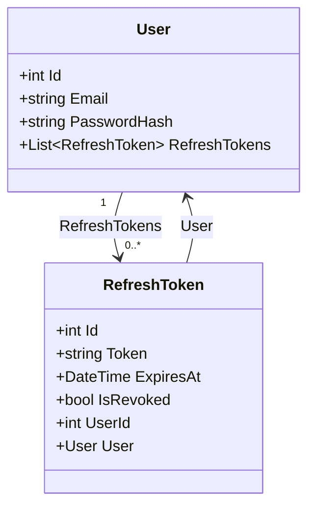

Belege: [User](../Backend/ImmscoutAPI/Model/Authorization/User.cs#L3), [RefreshToken](../Backend/ImmscoutAPI/Model/Authorization/RefreshToken.cs#L3), [DbContext](../Backend/ImmscoutAPI/DataBase/AppDbContext.cs#L6).

## SQLite-Datenmodell

Die Migration bildet die C#-Typen auf die folgenden SQLite-Typen ab:

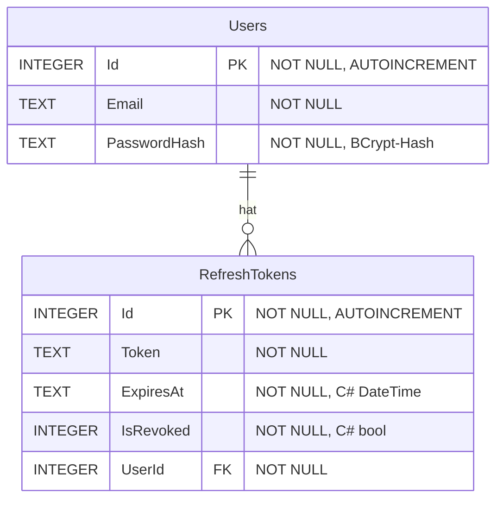

Jeder RefreshToken gehört zu genau einem Benutzer. Ein Benutzer kann keinen, einen oder mehrere RefreshTokens haben. `RefreshTokens.UserId` verweist auf `Users.Id`; die Migration legt einen Index auf `UserId` und `ON DELETE CASCADE` an. Alle dargestellten Spalten sind `NOT NULL`. Die E-Mail besitzt keinen `UNIQUE`-Constraint: Der Service prüft vor dem Anlegen auf eine bereits vorhandene E-Mail. Das ist eine Prüfung im Programm, keine Eindeutigkeitsgarantie der Datenbank.

Das Backend wendet beim Start EF-Core-Migrationen an. Zusätzlich zu den beiden Anwendungstabellen können technische SQLite-/EF-Tabellen existieren; sie sind hier nicht als fachliche Entitäten dargestellt.

Belege: [Tabellen und Constraints der Migration](../Backend/ImmscoutAPI/Migrations/20260701123011_InitialCreate.cs#L14), [E-Mail-Prüfung](../Backend/ImmscoutAPI/Service/AuthService%20.cs#L21), [Migration beim Start](../Backend/ImmscoutAPI/Program.cs#L55).

## Grenzen des aktuellen Systems

- Die externe Anfrage verwendet fest `page=1` und `pageSize=30`. Die Zählungen beschreiben die geladenen Treffer und keine vollständige Statistik aller Mietangebote in Stuttgart. Weitere API-Seiten werden nicht geladen.
- Der Cache besteht pro laufendem Backend-Prozess und geht bei dessen Beendigung verloren. Es gibt keine dauerhafte Offline-Kopie der Angebote.
- HTTP-Fehler des externen Dienstes und ungültiges JSON können als Ausnahmen bis zum Controller gelangen. Eine eigene verständliche HTTP-Fehlerantwort für diesen Fall fehlt.
- Registrierung hat derzeit keine wirksame serverseitige Prüfung von E-Mail-Format oder Mindestlänge des Passworts. RefreshTokens werden als Tokenwerte in SQLite gespeichert.

Belege: [API-Service, feste Anfrageparameter](../Backend/ImmscoutAPI/Service/ImmoScoutAPIService.cs#L17), [Cache und Deserialisierung](../Backend/ImmscoutAPI/Service/DistrictDataService.cs#L22), [RegisterRequest](../Backend/ImmscoutAPI/DTO/RegisterRequest.cs#L3), [AuthService](../Backend/ImmscoutAPI/Service/AuthService%20.cs#L21).

## Verifikation und Reichweite

Am 04.10.2026 war der vollständig neu kompilierte Backend-Build erfolgreich, mit 0 Fehlern und 28 Warnungen zu nicht initialisierten nicht-nullbaren Modelleigenschaften. Die vorhandenen [Backend-Checks](../Backend/ImmscoutAPI.Checks/Program.cs#L17) bestanden. Sie prüfen die Listing-Verarbeitung sowie echte lokale HTTP-Anfragen an die Immobilienendpunkte mit simulierten API-Antworten und einem Testauth-Handler.

Zusätzlich wurde der echte Backend-Auth-Flow mit einer eigenen temporären SQLite-Datenbank geprüft: Registrierung, Duplikatprüfung, Passwortprüfung, Ausgabe von Tokens und Refresh-Rotation funktionierten. Ein bereits rotierter RefreshToken wurde abgewiesen. Dabei wurde auch nachgewiesen, dass leere oder ungültige Registrierungsdaten akzeptiert werden. Dieser zusätzliche Prüflauf ist bisher kein automatisierter Test im Repository.

Die externe RapidAPI wurde bei diesen isolierten Prüfungen nicht aufgerufen. Spätere echte Desktopproben bestätigten Login, API HTTP 200, Angebote, Bezirksfilter, Details/Bildwechsel und Logout. Die jüngste Kartenprüfung deckt zusätzlich alle 152 sichtbaren Stadtteilflächen und 23 Bezirkslegenden mit echten Mausklicks in Chrome und WebKit ab; die Detailrückkehr erhält jetzt die Markierung. Das sind konkrete lokale Liveprüfungen, keine Zusicherung vollständiger Markt- oder Mobilabdeckung. [Vollprüfspur und Quellen](demo/karten-vollpruefung.json).

Weiterlesen: [Pseudocode der wichtigsten Algorithmen](algorithmen.md).
