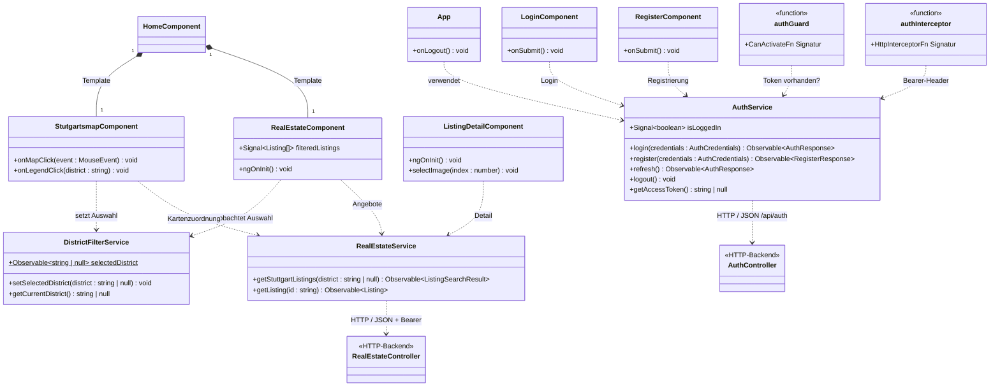
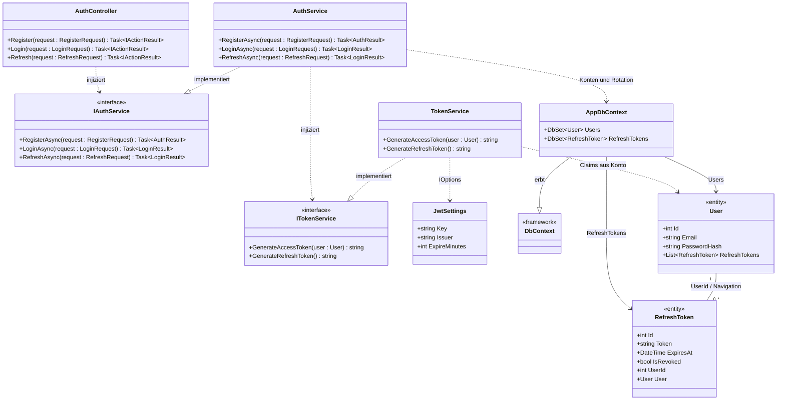
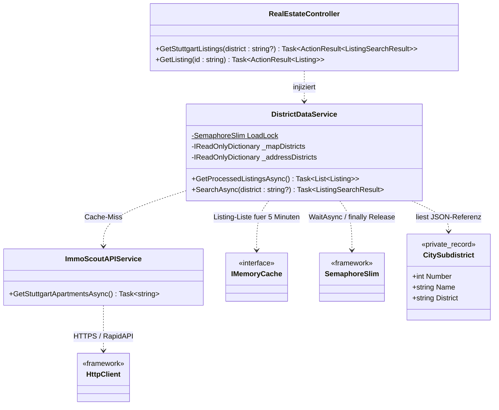
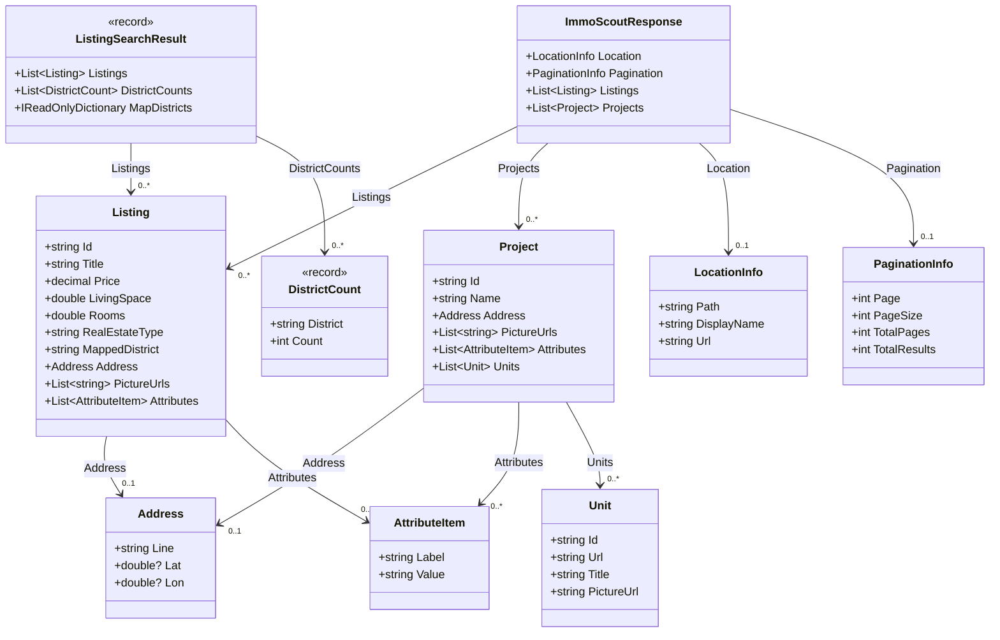
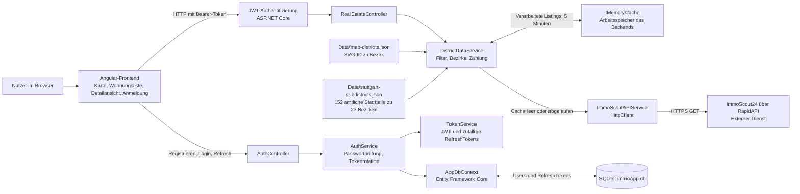

# Retrospektive – TopImmo

## Rahmen und gemeinsames Ergebnis

Der aktuelle lokale Stand umfasst ein Angular-Frontend und ein C#-/ASP.NET-Core-Backend. Nutzer können sich registrieren und anmelden, Mietwohnungen in Stuttgart nach Bezirk auswählen und Angebotsdetails ansehen. Das Backend verarbeitet externe ImmoScout24-Daten, ordnet Bezirke zu und zählt die geladenen Angebote. Benutzer und RefreshTokens werden mit EF Core in SQLite gespeichert.

Die technischen Grundvorgaben API, SQLite und C# sind damit implementiert. Live-API und vollständiger Browserablauf sind durch die bisherigen automatisierten Prüfungen noch nicht belegt.
## Funktionale Zuordnung mit Belegen

| Person / Account | Funktion | Nachweisbarer Beitrag | Commit und Datum |
|---|---|---|---|
| Edhar / `LotAnderson` | Früherer Backend-Prototyp | Eigene Projektbasis, RapidAPI-Client und URL-Zusammenstellung, Speicherung externer JSON-Antworten in SQLite; später Endpunkte, einfacher Login mit Session-ID und Duplikatbehandlung. Dieser historische Ansatz wurde durch den heutigen Backendansatz ersetzt. | [1fad2a5a](https://github.com/LotAnderson/TopImmo/commit/1fad2a5ab3b01dbbe4814895d45448981b1279ca), 30.06.; [c411b2af](https://github.com/LotAnderson/TopImmo/commit/c411b2afc10834b2b62039abd4ecb442996fd675), 16.07.; [fa3f8289](https://github.com/LotAnderson/TopImmo/commit/fa3f82896423e4d815fcccb142fa73280fa53dbd), 21.07.; [ae9043e4](https://github.com/LotAnderson/TopImmo/commit/ae9043e4c9a68eae428854145c3515094f3da74d), 28.09. |
| Toktorally / `Toktoraly` | Grundlage des heutigen Backends | Externer API-Adapter, JSON-Deserialisierung, Datenmodelle und erste Bezirkszuordnung; EF-Core-Kontext, SQLite-Migrationen, Benutzer/RefreshTokens, BCrypt und Token-Service. | [8a91593b](https://github.com/LotAnderson/TopImmo/commit/8a91593b93a25ec4059aff5ff22a59c5abed3dca), 02.07. |
| Toktorally / `Toktoraly` | Angular-Grundlage | Erster Angular-Import mit Immobilienliste, SVG-Stuttgartkarte, Hover/Auswahl, Bezirkfilter und HTTP-Service. | [d59e6b38](https://github.com/LotAnderson/TopImmo/commit/d59e6b38695b7721efbaa93bf2088bb69739795f), 02.07. |
| Toktorally / `Toktoraly` | Sicherheit im Backend | Login-/Register-/Refresh-Ablauf vervollständigt; Refresh-Token-Rotation, `AddJwtBearer`, Authentifizierungs-Middleware und `[Authorize]` für Immobilienendpunkte. | [23ceb19d](https://github.com/LotAnderson/TopImmo/commit/23ceb19d2f4d4f19c95968fe9e5412fae77553d7), 16.07. |
| Toktorally / `Toktoraly` | Sicherheit und Details im Frontend | Login-/Registrierungsseiten, AuthService mit lokalem Token-Speicher, Guard, Bearer-Interceptor und geschützte Routen; eigene Detailseite mit Bilderauswahl und Frontend-Zwischenspeicher. | [23ceb19d](https://github.com/LotAnderson/TopImmo/commit/23ceb19d2f4d4f19c95968fe9e5412fae77553d7), 16.07. |
| Edhar / `LotAnderson` | Projektstruktur und Integration | Angular-Projekt und bestehendes Backend reorganisiert. Viele Dateien wurden unverändert verschoben; die Verschiebung überträgt ihre ursprüngliche Implementierung nicht auf den neuen Commitautor. | [65d0d315](https://github.com/LotAnderson/TopImmo/commit/65d0d315d904320ba952024a1054af576b5b8036), 02.10.; [2d447a7b](https://github.com/LotAnderson/TopImmo/commit/2d447a7b17d72a2f7b36fdb03ba70b0d6b211037), 04.10. |
| Edhar / `LotAnderson` | Suche, Details und gemeinsamer Datenvertrag | Aktuelles `ListingSearchResult` mit Angeboten, Bezirkszahlen und Kartenzuordnung; Bezirkfilter als Query-Parameter und Detailendpunkt. Backendcontroller mit gemeinsamem 5-Minuten-Cache und Semaphore; Angular-Service, Lade-/Fehlerzustände und Prüfungen abgestimmt. Dieser Stand ist erstmals in diesem Integrationscommit gespeichert; der genaue Einzelautor jeder zuvor lokalen Änderung ist nicht überliefert. | [2d447a7b](https://github.com/LotAnderson/TopImmo/commit/2d447a7b17d72a2f7b36fdb03ba70b0d6b211037), 04.10. |
| Edhar / `LotAnderson`, mit Codex-Agent | Lokale Konfiguration | Private Konfiguration ausgelagert, sichere Vorlage und Setup-Skript ergänzt, Startvalidierung erweitert; lokale Datenbanken und Builddateien aus der laufenden Versionierung entfernt. | [bd61d774](https://github.com/LotAnderson/TopImmo/commit/bd61d7747864498bf1fcb4e42b8d07e1cc410517), 04.10. |
| Edhar / `LotAnderson`, mit Codex-Agent | Bezirkszuordnung und Kartenbedienung | Kanonische Referenz für 23 Bezirke/152 Stadtteile, Adressnormalisierung und Prüfungen; Pointer-/Klickfehler dekorativer SVG-Ebenen behoben, alle Bezirke in der Legende verfügbar, Tastaturbedienung und Markierung nach Detailrückkehr verbessert. | [60d91eec](https://github.com/LotAnderson/TopImmo/commit/60d91eec47d65c8823a9aa7621c0f42bb6c9cfbd), 04.10. |
| Edhar / `LotAnderson`, mit Codex-Agent | Birkach-Süd | Nach Edhars Fehlerberichten Grundfarbe und dicke Bezirksgrenze Birkach/Plieningen korrigiert; Kartenregression und Browser-Geometrie geprüft. | [20a7b374](https://github.com/LotAnderson/TopImmo/commit/20a7b374dc9855c0881c2f00f54d9473a020c0a6), [e6567da8](https://github.com/LotAnderson/TopImmo/commit/e6567da8dc165339783c86ae98f7f6a8e14ca7de), 04.10. |

Alle Datumsangaben beziehen sich auf **2026** und den gespeicherten Commitstand. Der KI-Bericht beginnt nach Nutzerangabe **Ende Juli**; die früheren Juli-Beiträge stehen hier zusätzlich, damit die übernommene Grundlage sichtbar bleibt.

## Projektstruktur als UML-Klassendiagramme

### 1. Angular-Frontend

Komponenten verwenden drei gemeinsame Services. Die beiden Controller rechts stehen für die HTTP-Schnittstelle zum C#-Backend. Guard und Interceptor sind Funktionsknoten; Routen und `appConfig` sind Konfiguration, keine eigenen Klassen. `App` zeigt die Seiten über `RouterOutlet` an.

Mermaid-Quelltext anzeigen

Belege: [Komponenten und Routen](../Frontend/TomInnoFrondEnd/src/app/app.routes.ts), [AuthService](../Frontend/TomInnoFrondEnd/src/app/services/auth.ts), [RealEstateService](../Frontend/TomInnoFrondEnd/src/app/services/realestate.ts), [DistrictFilterService](../Frontend/TomInnoFrondEnd/src/app/services/district-filter.ts), [Guard](../Frontend/TomInnoFrondEnd/src/app/guards/auth.guard.ts), [Interceptor](../Frontend/TomInnoFrondEnd/src/app/interceptors/auth.interceptor.ts).

### 2. Backend: Authentifizierung und SQLite

`AuthController` verwendet `IAuthService`. Die Implementierung prüft Passwörter und speichert über EF Core; `TokenService` erzeugt JWTs und Refresh-Tokens. Nur die zwei dargestellten Entitäten werden in SQLite gespeichert.

Mermaid-Quelltext anzeigen

Belege: [AuthController](../Backend/ImmscoutAPI/Controllers/AuthController.cs), [AuthService](../Backend/ImmscoutAPI/Service/AuthService%20.cs), [TokenService](../Backend/ImmscoutAPI/Service/TokenService%20.cs), [AppDbContext](../Backend/ImmscoutAPI/DataBase/AppDbContext.cs), [User](../Backend/ImmscoutAPI/Model/Authorization/User.cs), [RefreshToken](../Backend/ImmscoutAPI/Model/Authorization/RefreshToken.cs).

### 3. Backend: Immobiliensuche, Cache und Synchronisierung

`DistrictDataService` bereitet das externe JSON auf, bildet Stadtteile auf Bezirke ab und liefert die API-Antwort. `IMemoryCache` hält die aufbereiteten Angebote fünf Minuten pro Prozess; die statische Semaphore serialisiert das Nachladen.

Mermaid-Quelltext anzeigen

Belege: [RealEstateController](../Backend/ImmscoutAPI/Controllers/RealEstateController.cs), [DistrictDataService](../Backend/ImmscoutAPI/Service/DistrictDataService.cs), [ImmoScoutAPIService](../Backend/ImmscoutAPI/Service/ImmoScoutAPIService.cs), [Dienstregistrierung](../Backend/ImmscoutAPI/Program.cs).

### 4. Immobilien- und JSON-Datenmodelle

`ImmoScoutResponse` bildet die externe Antwort ab. Das Backend filtert daraus Mietangebote und erzeugt `ListingSearchResult` für Angular. Die weiteren Projekt-/Paginierungsfelder werden mit deserialisiert; die aktive Mietangebotssuche verwendet sie nicht.

Mermaid-Quelltext anzeigen

## Komponenten und Datenfluss

## Nachvollziehbare Verwendung

| Zeitraum / Aufgabe | Art des Einsatzes | Ergebnis und Grundlage |
|---|---|---|
| Ende Juli–August: Entwicklungsunterstützung | Chatbot in Microsoft Visual Studio; Frontend seltener, meist Chatbot | Selbstauskunft von Edhar. Einzelne damals mit KI bearbeitete Dateien, Prompts und Nutzungszeiten sind nicht vollständig überliefert. |
| September–02.10.: Entwicklungsstände | KI-Modus nicht belegt | Git zeigt unter anderem Backend-Duplikatbehandlung und Strukturänderungen. Diese Commits beweisen keinen Agenteneinsatz. |
| 04.10.: Code- und Anforderungsanalyse | Codex-Agent liest Quellen und führt Prüfungen aus | Backendbuild, vorhandene Backend-/Frontendprüfungen, zusätzliche isolierte Auth-/SQLiteprüfung und Abgleich der Anforderungen. Grenzen des Systems dokumentiert. [Issue #35](https://github.com/LotAnderson/TopImmo/issues/35) nennt Assistenzunterstützung ausdrücklich. |
| 04.10.: Projekt- und Scrumunterlagen | Analyse und Formulierung mit KI | Backlogabgleich, Retrospektive, Architektur, Pseudocode, Prüfbericht und vorbereitete Issue-Texte. [Issue #40](https://github.com/LotAnderson/TopImmo/issues/40) dokumentiert die lokale Vorbereitung mit Assistenz. Spätere Onlineänderungen sind von der lokalen Vorbereitung zu unterscheiden. |
| 04.10.: echte Demoprobe und Sicherung | Codex-Agent führt Browser- und Sicherungswerkzeuge aus | Registrierung, Login, echter RapidAPI-Abruf mit 28 Angeboten, Bezirkfilter, Detailseite/Bilder, Rückkehr und Logout; Screenshots sowie private Git-/Datei-/SQLite-Sicherungen mit Wiederherstellungsprüfungen. Bei der ursprünglichen Probe unveränderter Produktcode. [Issue #37](https://github.com/LotAnderson/TopImmo/issues/37). |
| 04.10.: Konfiguration | Codex-Agent ändert Dateien und prüft den neuen Stand | Private Schlüsselkonfiguration ausgelagert, Vorlage/Setup-Skript und Startvalidierung ergänzt, lokale DB-/Builddateien aus der Versionierung entfernt; lokales JWT-Geheimnis erneuert und bestehende lokale Refresh-Tokens widerrufen. [bd61d774](https://github.com/LotAnderson/TopImmo/commit/bd61d7747864498bf1fcb4e42b8d07e1cc410517). Anschließend bestand eine weitere Liveprobe mit neuer lokaler API-Konfiguration. |
| 04.10.: Bezirke und Karte | Codex-Agent implementiert und testet nach Nutzerauftrag | Referenz für 23 Bezirke/152 Stadtteile, Adressnormalisierung, Pointer-/Klickkorrektur, vollständige Legende und zuverlässige Auswahl nach Detailrückkehr; Regressionstests sowie echte Chrome-/WebKit-Klickprüfungen. [60d91eec](https://github.com/LotAnderson/TopImmo/commit/60d91eec47d65c8823a9aa7621c0f42bb6c9cfbd). |
| 04.10.: Birkach-Süd | Nutzer meldet Fehler; Codex-Agent korrigiert und prüft | Grundfarbe und dicke Bezirksgrenze berichtigt, Browser-Geometrie und Regression geprüft. [20a7b374](https://github.com/LotAnderson/TopImmo/commit/20a7b374dc9855c0881c2f00f54d9473a020c0a6), [e6567da8](https://github.com/LotAnderson/TopImmo/commit/e6567da8dc165339783c86ae98f7f6a8e14ca7de). |
| 04.–05.10.: Lern- und Präsentationsunterlagen | Codex-Agent erstellt Texte/Dateien; Chat erklärt Technik | NotebookLM-Quelltext, deutsche Folien, PDF/HTML, Sprechnotizen und technische Vertiefung zu JSON, SQLite, Cache, Semaphore, JWT und lokalen Voraussetzungen. [Issue #39](https://github.com/LotAnderson/TopImmo/issues/39) und [Arbeitsjournal](KONTEXT-UEBERGABE.md). |
| 04.–05.10.: Git und Hauptbranch | Codex-Agent arbeitet lokal; Nutzer veröffentlicht auf GitHub | Sicherung und Branchwechsel vorbereitet, getrennte Historien in einer Prüfkopia verbunden, lokalen Branch `Presentation` vorbereitet; Nutzer pusht und mergt PR #42, Agent gleicht anschließend lokales `main` ab. [3ca57306](https://github.com/LotAnderson/TopImmo/commit/3ca57306c001a0686a622b1e1c673beea887033a), [PR #42](https://github.com/LotAnderson/TopImmo/pull/42). |
| 05.10.: UML und aktuelle Nachweise | Codex-Agent mit unabhängigen Quellprüfungen | Vier Klassenansichten in [architektur.md](architektur.md), SVG/Mermaid und zusätzliche [PlantUML-Datei](architektur.puml); tatsächliche lokale Renderprüfung. Anschließend Commit-Beitragsprüfung und dieser KI-Bericht. Aktuelle Dokumentationsänderungen sind noch nicht neu eingecheckt. |

## Verbesserungen und unmittelbare nächste Schritte

1. Boardstatus mit dem tatsächlichen Code abgleichen und Nachträge datieren. Historische Leistungen erhalten; aktuelle Aufgaben nach den zwei Zeiträumen aufführen.
2. Für kommende Arbeit Aufgabe, verantwortliche Person, Schätzung und tatsächlichen Aufwand zeitnah festhalten. Vergangene Zeiten bleiben unbekannt, soweit keine Aufzeichnung existiert.
3. Aktuellen Präsentationsstand sichern und den echten Browserablauf proben. Eine größere Hauptbranch-Zusammenführung darf den funktionierenden Präsentationsstand nicht gefährden.
4. Architektur, wichtige Verarbeitung und zwei bis drei tatsächlich eigene Aufgaben verständlich erklären. Vorarbeit anderer Beteiligter dabei sichtbar zuordnen.
5. Nach der Präsentationsvorbereitung die bekannten Validierungs-, Sitzungs-, Build- und Bedienungsprobleme gezielt beheben und die betroffenen Abläufe prüfen.

Der [Backlog](backlog.md) enthält den konkreten Abgleich mit den Boardaufgaben. Die Retrospektive ersetzt keine historischen Scrumprotokolle und keine Bewertung durch die Lehrkraft.
